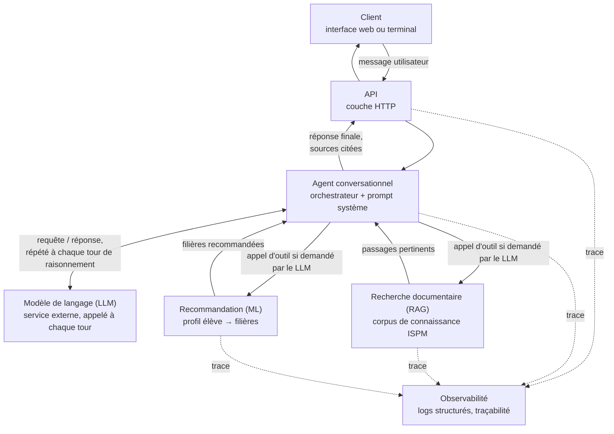
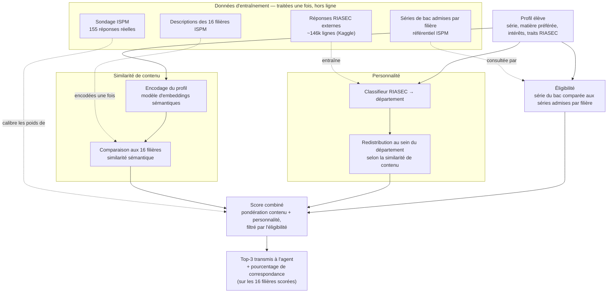

# Schéma d'architecture — ORIENT'IA

## Lecture du schéma

- **Deux sources de connaissance** alimentent l'agent : un corpus documentaire interrogé par
  recherche (RAG) et un modèle de recommandation entraîné sur des données réelles (ML).
- **L'agent ne raisonne jamais seul** : à chaque tour, il interroge le LLM, qui décide soit
  d'appeler un outil (RAG ou ML) pour obtenir de l'information fiable, soit de répondre
  directement. Le LLM ne calcule et n'invente jamais lui-même une recommandation ou un fait —
  il orchestre et formule, en s'appuyant uniquement sur ce que les outils lui renvoient.
- **Tout est traçable** : chaque requête, chaque appel au LLM et chaque appel d'outil sont
  chronométrés et logués de façon structurée, avec un identifiant commun qui relie un message
  client à tout ce qu'il déclenche en aval.
- Le modèle de recommandation est chargé une seule fois au démarrage du service, pas à chaque
  requête.

## Détail : pipeline de recommandation (ML)

Zoom sur le bloc « Recommandation (ML) » du schéma général : comment un profil élève devient un
classement de filières.

- **Deux signaux indépendants se combinent** : une similarité sémantique (le profil « ressemble »
  textuellement à quelle filière ?) et une prédiction de personnalité (le profil RIASEC oriente vers
  quel département ?). Aucun des deux ne suffit seul.
- **L'éligibilité pondère sans exclure** : une série de bac inconnue ou hors liste ne fait pas
  disparaître une filière, elle reçoit juste un poids plus faible — ce n'est pas une règle
  d'admission officielle.
- **Le classement complet n'est jamais transmis à l'agent** : les 16 filières sont scorées, mais
  seules les 3 meilleures sortent du pipeline — le LLM ne voit jamais le score des 13 autres. S'il
  doit se prononcer sur une filière hors top-3 (y compris une qui correspond mal au profil) parce
  que l'utilisateur la nomme explicitement, il ne le fait pas via ce score de correspondance : il
  passe par l'outil d'éligibilité ou par la recherche documentaire, en dehors de ce pipeline de
  recommandation.
- **Quatre entrées hors-ligne** construisent l'artefact chargé au démarrage : le classifieur de
  personnalité est entraîné sur un jeu de données externe plus large que les données collectées
  pour ce projet, les embeddings des 16 filières sont calculés une fois pour toutes, le
  référentiel d'admission est consulté à chaque appel mais ne change pas, et le sondage réel ISPM
  sert uniquement à calibrer le poids relatif des deux signaux. Seul le profil élève est traité en
  direct, à chaque requête. Voir [`src/orientia_ml/README.md`](../src/orientia_ml/README.md) pour
  les métriques mesurées et le détail d'implémentation.
